 

  

 

**🎓 MSc Blockchain Technology** @ MIT-WPU&nbsp; · &nbsp;**💼 Software Developer Intern** @ Nexolve Technologies&nbsp; · &nbsp;**🚀 Founder** @ UploftAI

 

<h2 id="about">

</h2>

<table>
<tr>
<td width="55%" valign="top">

I'm an engineer working across **AI, full-stack products, and blockchain systems** — from LLM-powered applications to smart contracts and production-grade web platforms.

- 📍 Based in **Pune, India**
- 🎓 Currently pursuing **MSc Blockchain Technology** — MIT World Peace University
- 🧠 Background in **BSc Computer Science**
- 🛠️ Ship full-stack products end-to-end: design → backend → smart contracts → deployment
- ⚙️ Comfortable moving between an LLM prompt chain, a Solidity contract, and a Next.js frontend in the same afternoon

</td>
<td width="45%" valign="top">

> **Right now**
> Building [UploftAI](https://uploftai.vercel.app/), an AI resume optimizer, while finishing my Master's and shipping blockchain + AI side projects.
>
> **Next**
> Growing into an AI / Full-Stack / Blockchain engineering role on products used at scale.
>
> **Eventually**
> Founding a product studio — and, longer term, an ecosystem of my own on-chain.

</td>
</tr>
</table>

 

<h2 id="stack">

</h2>

<table>
<tr><td width="150"><b>Languages</b></td><td>

</td></tr>
<tr><td><b>Frontend</b></td><td>

</td></tr>
<tr><td><b>Backend</b></td><td>

</td></tr>
<tr><td><b>Database</b></td><td>

</td></tr>
<tr><td><b>Tools</b></td><td>

</td></tr>
<tr><td><b>Currently Learning</b></td><td>

</td></tr>
</table>

**AI**

**Blockchain**

 

<h2 id="projects">

</h2>

<table>
<tr>
<td width="50%" valign="top">

### 🚀 [UploftAI](https://uploftai.vercel.app/)
**AI Resume Optimizer · Founder**

ATS-focused resume analysis and scoring platform with AI-driven suggestions, pricing plans, and authentication — built and shipped solo.

`Next.js` `TypeScript` `Supabase` `Gemini API` `Tailwind` `Vercel`

Details

 

- ATS resume optimization & scoring
- AI-driven resume analysis and suggestions
- Subscription pricing plans
- Full authentication flow
- Responsive, production-grade UI

**Role:** Founder · Full-Stack Developer · AI Integration

</td>
<td width="50%" valign="top">

### 🧪 [TESTGENAI](https://github.com/kilobyte-developer/TEAM-DEPLOY-OR-DIE) · [Live demo](https://team-deploy-or-die.vercel.app/)
**AI-Powered Test Case Generator · Hackathon**

Generates and runs test suites from source code and user stories, with coverage analysis and human-readable reports.

`Next.js` `FastAPI` `Python` `Groq` `PyTest` `Coverage`

Details

 

- Upload Python source code and user stories
- AI-generated test cases from requirements
- Automated test execution + coverage analysis
- Human-readable test reports

**Role:** Project Lead · Architecture · Backend Integration

</td>
</tr>
<tr>
<td width="50%" valign="top">

### 🔒 [StealthPay](https://github.com/kilobyte-developer/Stealth-Address-Payment-System)
**Privacy-Preserving Web3 Payments**

Blockchain payment platform using stealth-address cryptography for unlinkable, one-time recipient addresses on institutional-grade transactions.

`Blockchain` `React` `Node.js` `Smart Contracts`

Details

 

- Privacy-preserving crypto payments
- Wallet integration
- Secure, auditable transaction flow
- Modern, production-style UI

</td>
<td width="50%" valign="top">

### 🎨 [RAAS](https://github.com/kilobyte-developer/Raas2.0)
**Art Studio Commerce Platform**

Full-stack portal for an art studio to showcase work, sell pieces, and manage customer relationships online.

`Next.js` `Node.js` `Supabase`

Details

 

- Art showcase & gallery
- E-commerce checkout flow
- Customer portal

</td>
</tr>
<tr>
<td width="50%" valign="top">

### 🧳 [DeFi Travel Insurance](https://github.com/kilobyte-developer/avax-hackathon-d-day)
**On-Chain Insurance · Hackathon**

Smart-contract-based travel insurance with pooled coverage and automated claim validation on Avalanche.

`Solidity` `Avalanche` `Hardhat`

Details

 

- Insurance pool smart contracts
- Automated claim validation
- Deployed & tested on Avalanche via Hardhat

</td>
<td width="50%" valign="top">

 

</td>
</tr>
</table>

 

<h2 id="experience">

</h2>

**Software Developer Intern** — Nexolve Technologies

Worked across blockchain products, full-stack applications, smart contracts, AI integrations, and production deployments.

 

<h2 id="stats">

</h2>

 

 

<b>Trophies</b>

 

 

<picture>
  <source media="(prefers-color-scheme: dark)" srcset="https://raw.githubusercontent.com/kilobyte-developer/kilobyte-developer/output/github-contribution-grid-snake-dark.svg" />
  <source media="(prefers-color-scheme: light)" srcset="https://raw.githubusercontent.com/kilobyte-developer/kilobyte-developer/output/github-contribution-grid-snake.svg" />
  
</picture>

 

<h2 id="achievements">

</h2>

| | |
|---|---|
| 🥇 | **Winner** — Rikaian Innovate-a-Thon 2024 |
| 🥇 | **Winner** — PC Assembly Competition, Modern College GK 2023 |
| 🥈 | **Runner-up** — Blind Coding, Modern College GK 2024 |
| 🎯 | **Senior Coordinator** — National Conference on Data Science & its Challenges, 2025 |
| 🎓 | **8.65 GPA** — BSc Computer Science, Modern College GK, Pune |
| 🧠 | Hackathon builder across **AI + Blockchain** |

 

<h2 id="contact">

</h2>

I'm open to **AI Engineer**, **Full-Stack Engineer**, and **Blockchain Engineer** roles, and to interesting product collaborations.

  

Thanks for reading this far. ⭐ this profile if any of it was useful to you.

